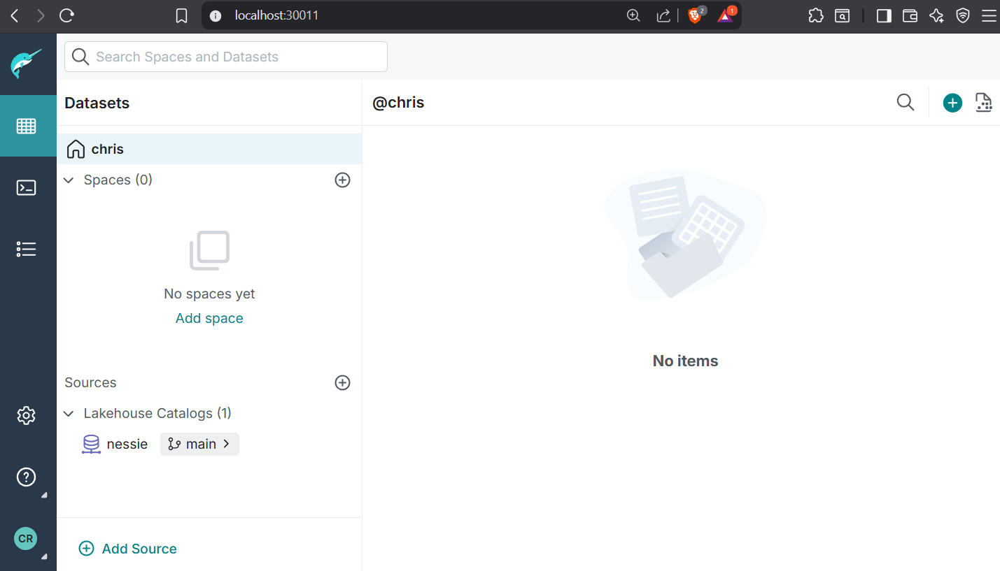
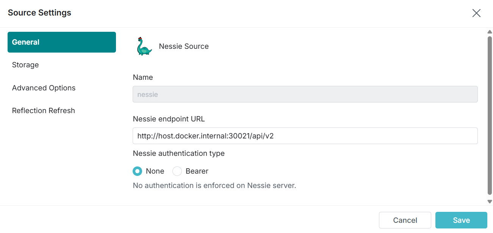
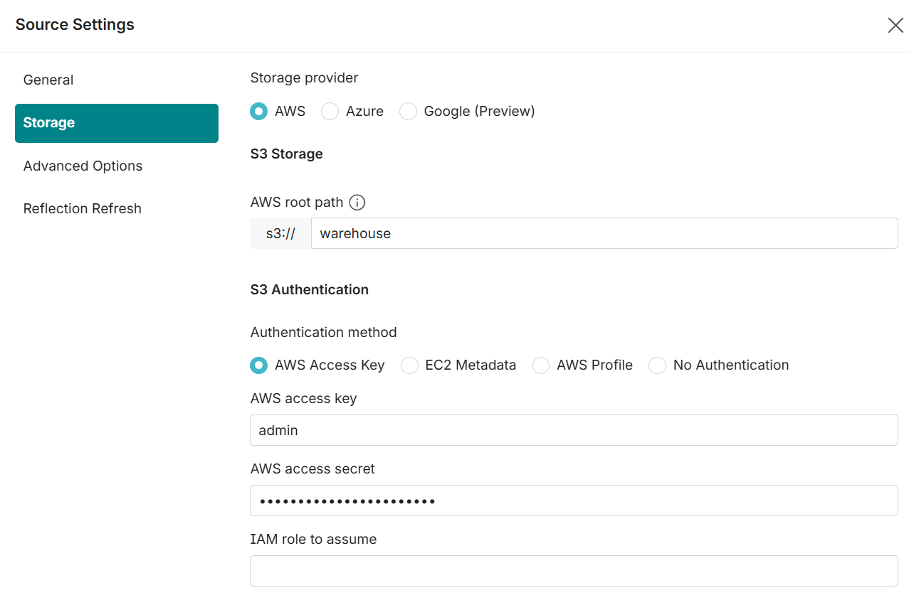
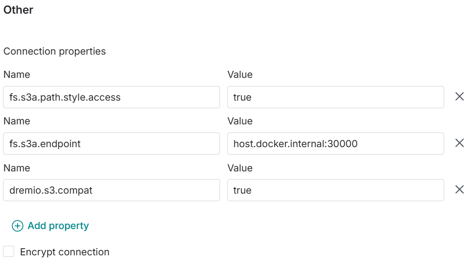

# Install Dremio 

Dremio offers a Web GUI to several different datasources, including a Nessie Iceberg Store :-) 

so let's install the dremio container:

as usual let's start with the persistent volumes. Please adjust the directories !
kubectl apply -f dremio-pv.yaml
 [dremio-pv.yaml](deployments/dremio-pv.yaml)

then let's install the deployment:
kubectl apply -f dremio-deployment.yaml
 [dremio-depl.yaml](deployments/dremio-depl.yaml)

and finally let's map some ports:
kubectl apply -f dremio-services.yaml
 [dremio-services.yaml](deployments/dremio-services.yaml)

We are creating mappings for the following ports:  

9047  --> 30011 : Web UI http://localhost:30011
31010 --> 31010 : ODBC/JDBC clients
32010 --> 32010 : Apache Arrow Flight clients  
45678 --> 31012 Inter-node communication

now let's connect to the dremio container:

http://localhost:30011

on first start, you need to configure a user. Afterwards we can start playing around ...

first we need to add a source:
as we are running everything locally, we don't care for security ...
 our Nessie endpoint URL is:  
http://host.docker.internal:30021/api/v2

as the container is running inside the cluster, localhost is not working, but rancher / docker is offering host.docker.internal as an alternative
. And we make our life simple setting authentication type to None  

Now let's set up the storage parameters. 
The AWS root path is s3://warehouse 
  if the bucket is not yet existing, create the bucket in the min.io gui: http://localhost:30001

The AWS access Key and secret we defined in the Minio section: admin / password 

finally we need to add some properties: 

 fs.s3a.path.style.access : true
 fs.s3a.endpoint : host.docker.internal:30000
 dremio.s3.compat : true

don't forget to untick Encrypt connection

