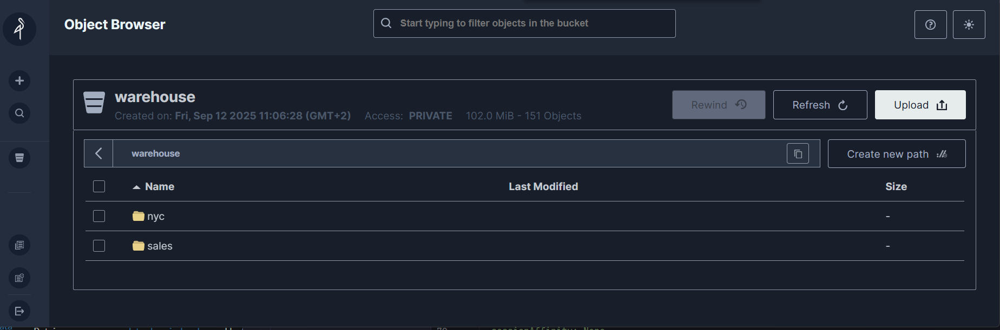

# Setting up MinIO

First we create two Volumes, a persistent volume and the according persistent volume claim:

kubectl apply -f minio-pv.yaml
<br>[minio-pv.yaml](deployments/minio-pv.yaml)

It was a little bit tricky to find the proper path to the folder on my C-Drive. The correct 
syntax for a directory in C-Drive is:
<br>path: /mnt/c/_Rancher/data/minio/pv1
<br>(at least on my machine)

please create your own directory and change the path in the yaml file accordingly. 

The persistent volume is not attached to a namespace, but the claim is. 

Afterwards we can install the minio container with the community edition: 

kubectl apply -f minio-deployment.yaml 
<br>[minio-depl.yaml](deployments/minio-depl.yaml)

this installs the min.io community edition on ports 9000 (api) and 9001 and set's the 
user and password to admin/password. Also the persistent Volume is mounted and finally the server 
will be started. 

```
...
    spec:
      containers:
      - name: minio-container
        image: quay.io/minio/minio:latest
        ports:
        - containerPort: 9000
        - containerPort: 9001
        volumeMounts:
        - mountPath: "/data"
          name: vol-data-minio1
        env:
        - name: MINIO_ROOT_USER
          value: admin
        - name: MINIO_ROOT_PASSWORD
          value: password
        - name: MINIO_DOMAIN
          value: minio            
        command:
        - /bin/bash
        - -c
        args: 
        - minio server /data --console-address :9001
...      

```

Afterwards the container should already be running. You can check in the cluster dashboard in 
the section Workloads. There you should now find the minio deployment and the running pod. 
The persistent volumes you can find in the Storage section.

If the deployment, or better the startup of the pod is hanging, the please check, if the path to the 
persistent volume is correct.

The minio pod is now reachable inside the cluster, but not from outside the cluster. So let's add a service:

kubectl apply -f minio-services.yaml
<br>[minio-services.yaml](deployments/minio-services.yaml)

```
spec:
  ports:
    - name: minio-9000
      nodePort: 30000
      port: 30000
      protocol: TCP
      targetPort: 9000
    - name: minio-9001
      nodePort: 30001
      port: 30001
      protocol: TCP
      targetPort: 9001
  selector:
    app: minio-app
  sessionAffinity: None
  type: NodePort

```
The target port is the output port of the container, the nodeport is then reachable from a local browser. 
The port range between 30000 and 32767 is the default port range for nodeport services. 

Now we should be able to login to the min.io server: 

http://localhost:30001

the login is defined in the min.io deployment as  admin / password:



 