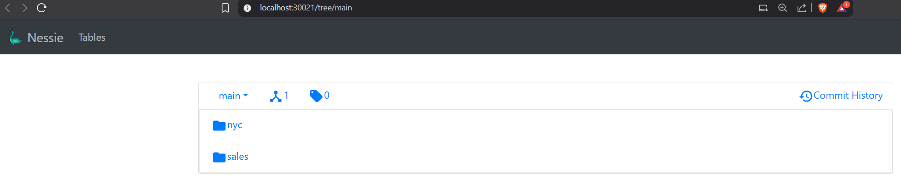
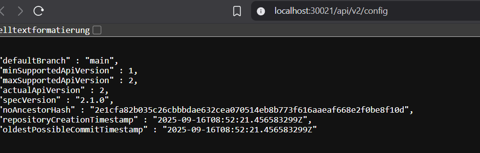

# Install Nessie iceberg catalog

ok, also here we will start with some persistent volumes: 
 (don't forget to create directory)

kubectl apply -f nessie-pv.yaml
[nessie-pv.yaml](deployments/nessie-pv.yaml)

and then create the container: 
kubectl apply -f nessie-deployment.yaml

 [nessie-depl.yaml](deployments/nessie-depl.yaml)

so the container is now creating, using port 19120 for communication. 

so let's reroute that port to the local port 30012: 

kubectl apply -f nessie-services.yaml
 [nessie-services.yaml](deployments/nessie-services.yaml)

now you should be able to test the installation: 

http://localhost:30021

 or
 http://localhost:30021/api/v2/config

